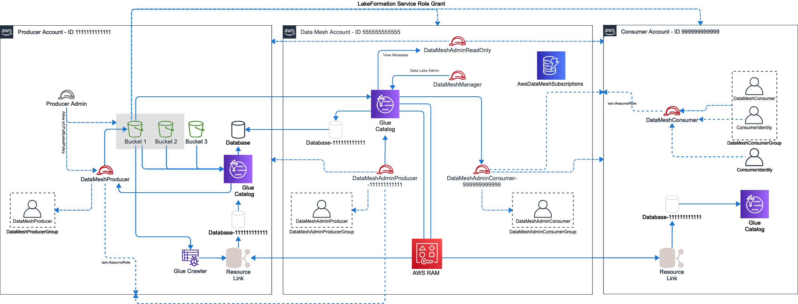

# DATA MESH PLATFORM ARCHITECTURE

Designing a self-service data mesh platform on AWS involves leveraging AWS services that can help with data storage, data processing, and data delivery. Here are some steps to consider:

* __Determine the data domains__: The first step is to identify the data domains within your organization and define the data products that you want to create. This will help determine the AWS services required to support your self-service data mesh platform.

* __Choose data storage solutions__: AWS offers a range of storage options, including Amazon S3, Amazon EBS, and Amazon Glacier. You can choose the storage solution that fits your needs based on the type of data and how frequently it needs to be accessed.

* __Set up data processing__: AWS offers several data processing services, including Amazon EMR, Amazon Athena, and Amazon Redshift. You can use these services to transform and analyze your data.

* __Deploy data services__: Use AWS services like Amazon API Gateway, Amazon AppSync, or Amazon Elasticsearch Service to deploy data services that provide a standardized way of accessing the data.

* __Implement governance mechanisms__: AWS offers several security and governance tools like AWS Identity and Access Management (IAM), AWS Key Management Service (KMS), and Amazon CloudTrail. You can use these tools to manage access to your data and track user activity.

* __Provide training and support__: It's essential to provide adequate training and support to end-users so they can effectively use the self-service data mesh platform. Consider using AWS services like Amazon Connect or Amazon Chime for support.


## AWS Data Mesh Helper Library

The AWS Data Mesh Helper library provides automation around the most common tasks that customers need to perform to implement a data mesh architecture on AWS. A data mesh on AWS uses a central AWS Account (the mesh account) to store the metadata associated with __Data Products__ created by data __Producers__. This allows other AWS Accounts to act as __Consumers__, and to request __Subscriptions__, which must be approved by __Producers__. Upon approval, the approved grants are provided to the __Consumer__ and can be imported into their AWS Account.

[View aws-data-mesh-utils on Pypi](https://pypi.org/project/aws-data-mesh-utils/1.0/)

### Definition of Terms

* __Data Mesh__ - An architectural pattern which provides a centralised environment in which the data sharing contract is managed. Data stays within __Producer__ AWS Accounts, and they own the lifecycle of granting __Subscriptions__.
* __Producer__ - Any entity which offers a __Data Product__ through the __Data Mesh__
* __Consumer__ - Any entity who subscribes to a __Data Product__ in the __Data Mesh__
* __Subscription__ - The central record and associated AWS Lake Formation permissions linking a __Data Product__ to a __Consumer__
* __Data Product__ - Today, a __Data Product__ is scoped to be only an AWS Lake Formation Table or Database. In future this definition may expand.

### The Workflow

To get started, you must first enable an AWS Account as the __Data Mesh__ Account. This is where you will store all Lake Formation metadata about the __Data Products__ which are offered to __Consumers__. Within this Account, there exist IAM Roles for __Producer__ and __Consumer__
which allow any AWS Identity who has access to perform tasks within the Data Mesh.

Once you have setup an Account as the __Data Mesh__, you can then activate another AWS Account as a __Producer__, __Consumer__, or both. All of these tasks are performed by the __Data Mesh Admin__, which is accessible through an additional IAM Role or as any Administrator Identity within the mesh Account. Once completed, end users can perform the following Data Mesh tasks:

### Data Mesh Tasks

| Producer | Data Mesh Administrator | Consumer |
|----------|-----------|----------|
|* __Create Data Product__ - Exposes a Lake Formation Database and/or one-or-more Tables as __Data Products__ </br>* __Approve/Deny Subscription Request__ - Allows for a __Producer__ to approve a set of permissions against a Data Product  </br>* __Modify Subscription__ - Allows a Producer to expand or reduce the scope of a Consumer's access to a Data Product | </br>* __Initialize Mesh Account__ - Sets up an AWS Account to act as the central Data Mesh governance account</br>* __Initialize Producer Account__ - Sets up an AWS Account to act as a Data Producer </br>* __Initialize Consumer Account__ - Sets up an AWS Account to act as a Data Consumer </br>* __Enable Account as Producer__ - Identifies an account as a Producer within the Data Mesh Account </br>* __Enable Account as Consumer__  - Identifies an account as a Consumer within the Data Mesh Account | </br>* __Request Access to Product__ - Creates a request for access to a Data Product including requested grants </br>* __Finalize Subscription__ - Once a subscription has been granted for a data product, imports the metadata into the Consumer Account </br>* __List Product Access__ - Lists which subscriptions are available to the consumer including the status of the request | 

The following general functionality available to any Data Mesh role:
 
* __Delete Subscription__ - Allows a Consumer or Producer to delete a Subscription request. Can be used at any time. Please note the Subscription is not deleted, but instead is archived.
* __List Subscriptions__ - Lists all Subscriptions and their associated status for any number of filters
* __Get Subscription__ - Retrieves a single Subscription

### Overall System Architecture

The following diagram depicts the overall system architecture associated with a Data Mesh that is in use by a separate __Producer__ and __Consumer__ Accounts:



In this architecture, we can see that the data mesh is configured in AWS Account 555555555555, and contains a set of IAM Roles which allow identities within producer and consumer accounts to access the mesh. This includes:

* `DataMeshManager`: IAM Role allowing administration of the Data Mesh itself
* `DataMeshAdminProducer`: IAM Role enabling the assuming Identity to act as a __Producer__
* `DataMeshAdminConsumer`: IAM Role enabling the assuming Identity to act as a __Consumer__
* `DataMeshAdminReadOnly`: IAM Role that can be used for reading Metadata from the Data Mesh Account (only)

For testing and simplicity, every IAM Role in the solution is accompanied by a single IAM User who is a member of a Group specific to the function. This will enable you to add users to this Group should you wish to, rather than using a programmatic approach. IAM Roles are backed by an IAM Policy of the same name as the Role, and all objects in the IAM stack for AWS Data Mesh reside at path _/AwsDataMesh/_.

You can then see that there is a Producer Account 111111111111 who has been enabled to act as a __Producer__. Within this account we see a similar approach to IAM principals, with the creation of a `DataMeshProducer` IAM Role which is accompanied by an associated user and group. When configured, the `DataMeshProducer` group is granted rights to assume
the `DataMeshProducer-<account id>` role in the data mesh Account.

Similarly, we have a consumer Account 999999999999. This Account also includes IAM objects to enable data mesh access, including the `DataMeshConsumer` IAM Role, and associated IAM users and groups. Only the `DataMeshConsumer` role may assume the `DataMeshAdminConsumer-<account id>` role in the data mesh Account.

All information around current or pending subscriptions is stored in DynamoDB, in table `AwsDataMeshSubscriptions`. This table is secured for only those operations which Producers or Consumer roles are allowed to execute, and stores the overall lifecycle for Subscriptions.

### Example Credentials File

To run these functions, you must provide identities that can operate on the producer, consumer, or mesh accounts. These can be configured in a credentials file for simplicity, with the following structure:

```
{
  "AWS_REGION": "us-east-1",
  "Mesh": {
    "AccountId": "",
    "AccessKeyId": "",
    "SecretAccessKey": ""
  },
  "Producer": {
    "AccountId": "",
    "AccessKeyId": "",
    "SecretAccessKey": ""
  },
  "ProducerAdmin":{
    "AccountId": "",
    "AccessKeyId": "",
    "SecretAccessKey": ""
  },
  "Consumer": {
    "AccountId": "",
    "AccessKeyId": "",
    "SecretAccessKey": ""
  },
  "ConsumerAdmin": {
    "AccountId": "",
    "AccessKeyId": "",
    "SecretAccessKey": ""
  }
}
```

This file includes the following identities:

* **Mesh** - Administrative identity used to configure and manage central Data Mesh objects like catalogs and shared tables. This identity is required for initializing the Data Mesh infrastructure.
* **ProducerAdmin** - Administrative identity used to setup an account as as data producer. This identity is only used to enable an AWS account on initial setup.
* **ConsumerAdmin** - Administrative identity used to setup an account as as data consumer. This identity is only used to enable an AWS account on initial setup.
* **Producer** - Identity used for day-to-day producer tasks such as `create-data-product`, `approve-access-request` and `modify-subscription`. In general, you should use the pre-installed `DataMeshProducer` user or those users who are part of the `DataMeshProducerGroup` in the Producer AWS Account.
* **Consumer** - Identity used for day-to-day consumer tasks such as `request-access` and `import-subscription`. In general, you should use the pre-installed `DataMeshConsumer` user or those users who are part of the `DataMeshConsumerGroup` in the Consumer AWS Account.
